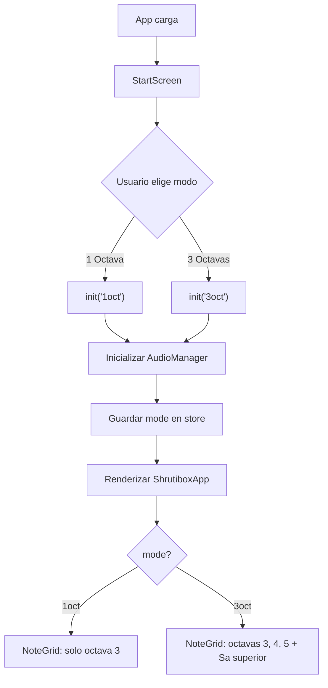
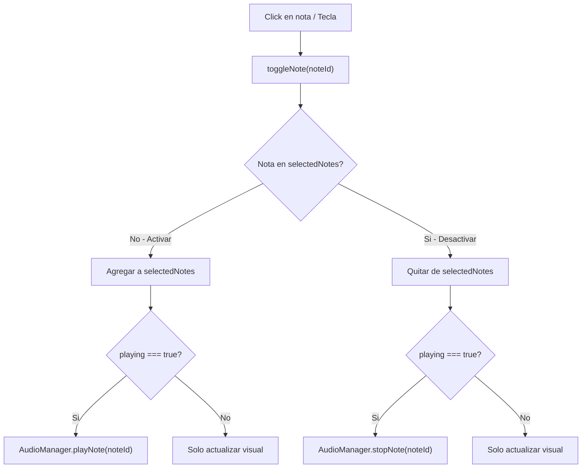
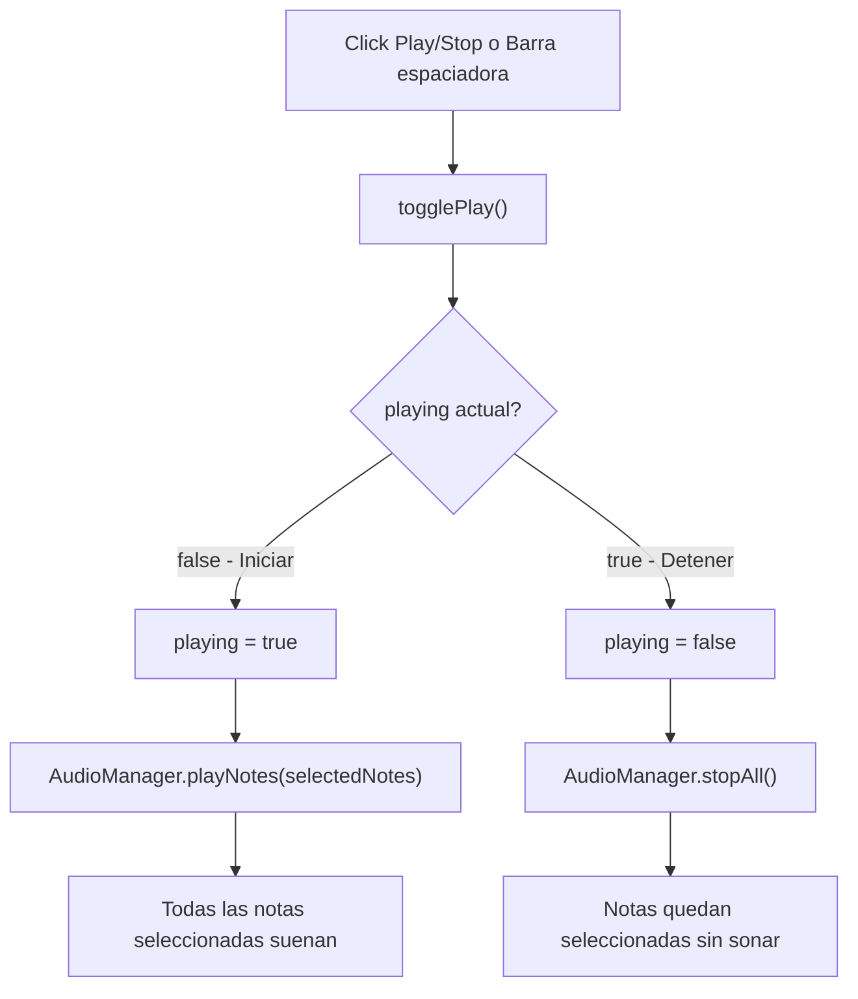
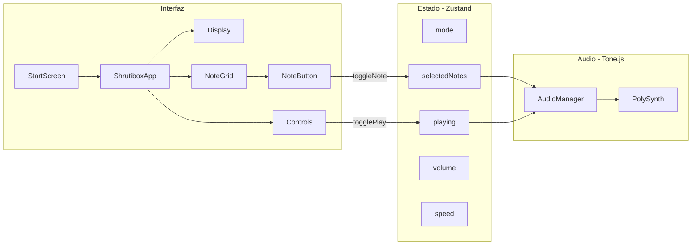

# Shrutibox Digital

Replica digital de un shrutibox acustico **Monoj Kumar Sardar 440Hz**, construida como aplicacion web con sintesis de audio en tiempo real.

El instrumento simula la experiencia de un shrutibox real: primero se seleccionan las notas (como abrir las lengüetas del instrumento), luego se activa la reproduccion (como bombear el fuelle) para generar el drone continuo.

## Caracteristicas

- **Selector de modo**: elige entre shrutibox de 1 octava (C3) o 3 octavas completas (C3-C6)
- **Sistema Sargam**: 7 notas por octava (Sa, Re, Ga, Ma, Pa, Dha, Ni) con notacion occidental
- **Toggle + Play/Stop**: selecciona notas con click, luego activa el drone con Play
- **Modificacion en tiempo real**: agrega o quita notas mientras el drone suena
- **Control de volumen**: ajuste de 0% a 100%
- **Control de velocidad**: modifica attack/release del envelope (0.25x a 3x)
- **Teclado fisico**: teclas A-J para las 7 notas, barra espaciadora para Play/Stop
- **Selector de octava**: elige que octava controla el teclado (en modo 3 octavas)

## Stack tecnologico

| Tecnologia   | Version | Uso                              |
| ------------ | ------- | -------------------------------- |
| React        | 19      | UI con componentes funcionales   |
| Vite         | 7       | Bundler y servidor de desarrollo |
| Tone.js      | 15      | Sintesis de audio (PolySynth)    |
| Zustand      | 5       | Estado global reactivo           |
| Tailwind CSS | 4       | Estilos utility-first            |

## Estructura del proyecto

```
src/
├── main.jsx                    # Punto de entrada de React
├── App.jsx                     # Componente raiz (StartScreen + ShrutiboxApp)
├── index.css                   # Import de Tailwind CSS
├── audio/
│   ├── AudioManager.js         # Motor de audio (singleton Tone.js)
│   └── noteMap.js              # Mapa de notas Sargam, frecuencias y octavas
├── store/
│   └── useShrutiStore.js       # Store Zustand (estado + acciones)
├── components/
│   ├── Display.jsx             # Panel informativo (nota activa, estado, octava)
│   ├── NoteGrid.jsx            # Grilla de notas por octava
│   ├── NoteButton.jsx          # Boton individual de nota (toggle)
│   └── Controls.jsx            # Play/Stop, volumen, octava, velocidad
├── hooks/
│   └── useKeyboard.js          # Mapeo de teclado fisico a notas
└── config/
    └── featureFlags.js         # Flags para habilitar/deshabilitar funciones
```

## Instalacion

```bash
npm install
```

## Desarrollo

```bash
npm run dev
```

## Build de produccion

```bash
npm run build
```

## Uso del instrumento

1. **Seleccionar modo**: al abrir la app, elige "1 Octava" o "3 Octavas"
2. **Activar notas**: haz click en las notas que deseas escuchar (se marcan como seleccionadas)
3. **Reproducir**: presiona el boton Play (o barra espaciadora) para iniciar el drone
4. **Modificar en vivo**: mientras suena, puedes activar o desactivar notas con click
5. **Detener**: presiona Stop (o barra espaciadora) para silenciar (las notas quedan seleccionadas)

### Atajos de teclado

| Tecla   | Accion     |
| ------- | ---------- |
| A       | Sa         |
| S       | Re         |
| D       | Ga         |
| F       | Ma         |
| G       | Pa         |
| H       | Dha        |
| J       | Ni         |
| Espacio | Play/Stop  |

## Diagramas de flujo

### Inicio de la aplicacion



### Interaccion con notas



### Boton Play/Stop



### Arquitectura general


