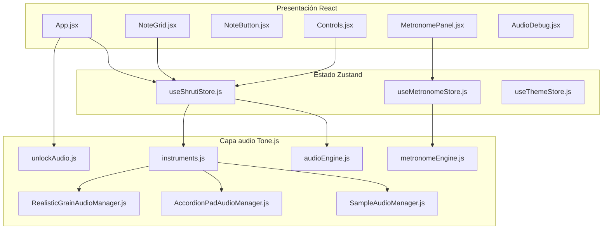

# Shrutibox OS Custom — Motor de audio, iOS/iPadOS y arquitectura

> **Propósito de este documento:** actuar como *spec* o *prompt* para agentes de código que **sí tienen acceso al repositorio**. Describe el dominio, la arquitectura en capas, el motor de audio, el problema conocido en iOS/iPadOS, la estrategia implementada, fortalezas/debilidades y mejoras posibles. Para investigación web sin acceso al repo, usar en su lugar `[ios-audio-research.md](ios-audio-research.md)`.

---

## 1. Stack y convenciones del proyecto

| Tecnología       | Versión (aprox.) | Rol                         |
| ---------------- | ---------------- | --------------------------- |
| React            | 19.x             | UI                          |
| Vite             | 7.x              | Build / dev server          |
| Tailwind CSS     | 4.x              | Estilos                     |
| Tone.js (`tone`) | 15.1.22          | Web Audio API de alto nivel |
| Zustand          | 5.x              | Estado global               |

**Convenciones (ver `[AGENTS.md](../AGENTS.md)`):**

- Cambios de **UI**: solo en `src/components` y `App.jsx`.
- Cambios de **audio**: solo en `src/audio/`.
- **No** mezclar lógica de Tone.js directamente en componentes React; el store llama al proxy `audioEngine`.

**Documentación relacionada en `docs/`:**

- `[architecture.md](architecture.md)` — arquitectura general y lista de componentes.
- `[audio-improvements.md](audio-improvements.md)` — clicks de loop, chorus, dual player cycling.
- `[realistic-engine.md](realistic-engine.md)` — bellows stagger / release del motor realista.
- `[src/audio/IOS_AUDIO_COMPAT.md](../src/audio/IOS_AUDIO_COMPAT.md)` — desbloqueo de contexto y bugs Tone/WebKit.

---

## 2. Contexto del dominio

Un **shruti box** (en este producto, réplica digital de un **Monoj Kumar Sardar 440 Hz**) es un instrumento de **drone sostenido**: múltiples lengüetas seleccionables, aire del fuelle, timbre orgánico y evolución temporal del sonido. La **calidad percibida** no es solo “sin clicks”: importan el **onset** (cómo entran las notas), la **textura** (granularidad vs sample plano), los **cruces de loop** y efectos como **chorus** sutil para bocinas mono.

La app es una **SPA web** (no hay binario nativo iOS); en iPhone/iPad corre en **Safari / WebKit** (todos los navegadores en iOS usan el mismo motor).

---

## 3. Arquitectura de la aplicación (tres capas)

### 3.1 Capa UI (`src/components/`, `App.jsx`)

- `**App.jsx**`: pantalla de inicio; el primer gesto del usuario debe llamar `unlockAudio()` y luego `init()` del store.
- `**NoteGrid.jsx**`: panel principal (visor, lengüetas, play/stop, volumen, toggles NOTAS / FX chorus, metrónomo).
- `**NoteButton.jsx**`, `**Controls.jsx**`, `**MetronomePanel.jsx**`, `**LanguageSelector.jsx**`, `**SkinSelector.jsx**`.
- `**AudioDebug.jsx**`: panel de diagnóstico (triple tap en el footer de créditos).

### 3.2 Capa estado (`src/store/`)

- `**useShrutiStore.js**`: instrumento activo, notas seleccionadas, play/stop, volumen, velocidad, chorus, `init`, `setInstrument`, guard de `resume()` en `togglePlay` para iOS post-background.
- `**useMetronomeStore.js**`: metrónomo (independiente del drone).
- `**useThemeStore.js**`: skins visuales.

### 3.3 Capa audio (`src/audio/`)

| Archivo                                                                       | Responsabilidad                                                                                                       |
| ----------------------------------------------------------------------------- | --------------------------------------------------------------------------------------------------------------------- |
| `[audioEngine.js](../src/audio/audioEngine.js)`                               | Proxy singleton: `setEngine`, delegación a motor activo; `setChorusEnabled` con optional chaining.                    |
| `[instruments.js](../src/audio/instruments.js)`                               | Registro de instrumentos; **fallback iOS** (`INSTRUMENTS_IOS` vs `INSTRUMENTS_DESKTOP`).                              |
| `[unlockAudio.js](../src/audio/unlockAudio.js)`                               | `Tone.start()` + silent buffer trick + verificación `running`.                                                        |
| `[isIOS.js](../src/audio/isIOS.js)`                                           | Detección iOS / iPadOS (incl. iPad con `MacIntel` + `maxTouchPoints > 1`).                                            |
| `[noteMap.js](../src/audio/noteMap.js)`                                       | 13 notas, rutas de samples (`fileKey`).                                                                               |
| `[RealisticGrainAudioManager.js](../src/audio/RealisticGrainAudioManager.js)` | Motor **desktop** principal: `GrainPlayer`, dual cycling, bellows, chorus.                                            |
| `[AccordionPadAudioManager.js](../src/audio/AccordionPadAudioManager.js)`     | Motor granular **desktop** para pad de acordeón.                                                                      |
| `[SampleAudioManager.js](../src/audio/SampleAudioManager.js)`                 | Motor `**Tone.Player`** con loop; usado en **iOS** como fallback.                                                     |
| `[GrainAudioManager.js](../src/audio/GrainAudioManager.js)`                   | Motor granular histórico / referencia (no está en la lista activa de `instruments.js` en la versión actual descrita). |
| `[AudioManager.js](../src/audio/AudioManager.js)`                             | Sintesis PolySynth; motor por defecto del proxy hasta `init()`.                                                       |
| `[metronomeEngine.js](../src/audio/metronomeEngine.js)`                       | Metrónomo (`Transport` + `Synth`).                                                                                    |

Samples estáticos en `public/`: `sounds-mks/`, `sounds-accordion-pad/`, `sounds-mks-xfade/` (xfade preprocesado, útil como alternativa de calidad).

---

## 4. Motor de audio en detalle

### 4.1 Proxy mutable `[audioEngine.js](../src/audio/audioEngine.js)`

- Exporta un **singleton** `audioEngine` construido inicialmente con `AudioManager` (sintético).
- Tras `useShrutiStore.init()`, el motor real se asigna con `audioEngine.setEngine(instrument.engine)`.
- `**setChorusEnabled`** delega con `this._engine.setChorusEnabled?.(enabled)` — si el motor no implementa el método (p. ej. `SampleAudioManager`), el toggle **no hace nada** en audio.

### 4.2 Registro dual por plataforma `[instruments.js](../src/audio/instruments.js)`

- `**runningOnIOS = isIOS()`** elige entre `INSTRUMENTS_DESKTOP` e `INSTRUMENTS_IOS`.
- **Desktop:** `mks-realistic` → `RealisticGrainAudioManager('/sounds-mks')`; `accordion-pad` → `AccordionPadAudioManager('/sounds-accordion-pad')`.
- **iOS:** los mismos IDs de instrumento y nombres en UI, pero motores `**SampleAudioManager`** apuntando a los mismos MP3.

**Motivo del fallback (resumen):** `Tone.GrainPlayer` en WebKit iOS puede quedar en **silencio total** (reloj interno / callbacks no fiables; issues Tone #572, #1051). `Tone.Player` crea `AudioBufferSourceNode` de forma directa y **sí reproduce**.

### 4.3 Cadenas de señal

**Desktop (motor realista / acordeón granular):**

`Tone.GrainPlayer` → `Tone.Gain` (por nota / crossfade) → `Tone.Volume` → `**Tone.Chorus`** → destino.

**iOS (`SampleAudioManager`):**

`Tone.Player` → `Tone.Volume` → destino (**sin** nodo chorus en el motor; el toggle FX no altera el timbre en iOS salvo que se implemente `setChorusEnabled` en ese motor).

### 4.4 Parámetros críticos de `SampleAudioManager`

Por defecto en clase: `loopStart: 1.0`, `loopEnd: 5.0`, fades cortos. Eso implica un **loop de ~4 s** con **salto** en el punto de loop — los `fadeIn`/`fadeOut` del `Tone.Player` **no suavizan cada iteración del loop**, solo arranque/parada del player (ver `[audio-improvements.md](audio-improvements.md)`).

---

## 5. Problema iOS / iPadOS — dos capas

### 5.1 Capa 1: AudioContext suspendido / autoplay

- WebKit exige **gesto de usuario** y que `resume()` / activación ocurran en el **cadena corta** desde el evento.
- **Implementación:** `[unlockAudio.js](../src/audio/unlockAudio.js)` — `Tone.start()`, silent buffer de 1 sample en `rawContext`, verificación y `rawContext.resume()` si hace falta.
- **Orden en UI:** en `[App.jsx](../src/App.jsx)`, el handler de inicio debe `await unlockAudio()` **antes** de otras operaciones async pesadas.
- **Post-background:** en `[useShrutiStore.js](../src/store/useShrutiStore.js)`, `togglePlay` comprueba `Tone.getContext().rawContext.state` y llama `resume()` si no está `running`.

### 5.2 Capa 2: GrainPlayer vs Player (pérdida de calidad)

| Aspecto                   | Desktop (`RealisticGrainAudioManager`)                                        | iOS (`SampleAudioManager`)                              |
| ------------------------- | ----------------------------------------------------------------------------- | ------------------------------------------------------- |
| Técnica principal         | Granular + **dual player cycling** (sin depender del loop built-in del grano) | **Loop built-in** del `Tone.Player`                     |
| Bellows stagger / release | Sí (`playNotes` / `stopNotes` con delays y fades escalados)                   | No (arranques/paradas más “digitales”)                  |
| Chorus FX                 | `setChorusEnabled` ajusta `wet`                                               | Método **no implementado** → silencio funcional del FX  |
| Loop seamless             | Crossfade entre instancias nuevas/viejas                                      | Riesgo de **click** cada vuelta de loop en región corta |

Referencias de issues (para búsqueda y contexto): [Tone #572](https://github.com/Tonejs/Tone.js/issues/572), [Tone #1051](https://github.com/Tonejs/Tone.js/issues/1051), [Tone #1225](https://github.com/Tonejs/Tone.js/issues/1225) (chorus/LFO en WebKit), [WebKit 248265](https://bugs.webkit.org/show_bug.cgi?id=248265).

---

## 6. Estrategia técnica actual — fortalezas y debilidades

### Fortalezas

1. **Compatibilidad iOS:** audio audible frente al bug de `GrainPlayer`.
2. **Desbloqueo centralizado** — evita múltiples `Tone.start()` en competencia (comentarios en motores).
3. **Detección iOS** razonablemente completa (incluye iPad “desktop UA”).
4. **Interfaz uniforme** entre motores + proxy defensivo (`?.`).
5. **Diagnóstico in-app** (`AudioDebug`) sin cable.
6. **Documentación interna** (`IOS_AUDIO_COMPAT.md`) con historial de iteraciones.

### Debilidades / riesgos

1. **Pérdida de fidelidad sonora** vs desktop (ver tabla §5.2).
2. `**SampleAudioManager` + loop corto** → clicks de loop **más frecuentes** que en el motor granular.
3. **Chorus** no aplicado en iOS aunque la UI sugiera lo contrario.
4. **Assets `sounds-mks-xfade/`** ya preparados para loop seamless **no** enlazados en `INSTRUMENTS_IOS`.
5. **No re-evaluación** reciente documentada de `GrainPlayer` en iOS 17/18 + Tone 15.x.
6. `**architecture.md`** puede quedar desalineado respecto a la lista exacta de instrumentos en `instruments.js` — la fuente de verdad es el código.

---

## 7. Mejoras posibles (priorización sugerida)

### A. Rápidas (bajo riesgo)

- Implementar `**setChorusEnabled**` en `SampleAudioManager` (misma cadena que motores granulares: `Volume` → `Chorus` → destino, `wet` 0 / 0.3).
- Ajustar `**loopEnd**` en iOS (p. ej. `null` = duración completa) o usar región más larga para **reducir frecuencia** de discontinuidades.
- **Bellows stagger** portado a `SampleAudioManager` vía `setTimeout` + orden cromático (reutilizar lógica de índices como en `RealisticGrainAudioManager`).

### B. Calidad de loop sin granularidad

- Instanciar `SampleAudioManager` en iOS con `**basePath: '/sounds-mks-xfade'`** y opciones `loopStart: 0`, `loopEnd: null` (crossfade offline — ver `scripts/generate-mks-xfade-samples.sh` y `[audio-improvements.md](audio-improvements.md)`).

### C. Investigación / mayor esfuerzo

- Probar de nuevo `**GrainPlayer**` en dispositivos iOS recientes y Tone 15.x; si funciona, feature-flag o detección por versión.
- **AudioWorklet** para granulación o crossfade con scheduling explícito.
- **Zero-crossing** u optimización de puntos de loop en cliente.

### D. No recomendado (documentado)

- Polyfill profundo del reloj interno de Tone en WebKit.
- `**MediaElementAudioSourceNode`** como base principal del drone (regresiones históricas en iOS 17.x en documentación del proyecto).

---

## 8. Guía rápida para agentes (dónde tocar qué)

| Objetivo                          | Archivo(s)                                                                                                                                               |
| --------------------------------- | -------------------------------------------------------------------------------------------------------------------------------------------------------- |
| Cambiar motor iOS vs desktop      | `[instruments.js](../src/audio/instruments.js)`                                                                                                          |
| Ajustar loop / fades del fallback | `[SampleAudioManager.js](../src/audio/SampleAudioManager.js)` + opciones en `instruments.js` al construir instancias iOS                                 |
| Lógica granular / bellows         | `[RealisticGrainAudioManager.js](../src/audio/RealisticGrainAudioManager.js)`, `[AccordionPadAudioManager.js](../src/audio/AccordionPadAudioManager.js)` |
| Desbloqueo / silent buffer        | `[unlockAudio.js](../src/audio/unlockAudio.js)`, `[App.jsx](../src/App.jsx)`                                                                             |
| Resume tras background            | `[useShrutiStore.js](../src/store/useShrutiStore.js)` `togglePlay`                                                                                       |
| Detección plataforma              | `[isIOS.js](../src/audio/isIOS.js)`                                                                                                                      |
| Proxy / chorus opcional           | `[audioEngine.js](../src/audio/audioEngine.js)`                                                                                                          |
| Debug in-app                      | `[AudioDebug.jsx](../src/components/AudioDebug.jsx)`                                                                                                     |

**Señales de que un bug es “el de iOS”:** solo ocurre en iPhone/iPad; el contexto está `suspended`; o hay silencio con `GrainPlayer` pero no con `Player`.

**Pruebas:** Safari en dispositivo real; menú **Desarrollar** en Safari macOS + inspector remoto; panel triple-tap en footer.

---

## 9. Checklist antes de cerrar un cambio de audio iOS

- ¿Sigue sonando tras bloquear/desbloquear pantalla y volver con Play?
- ¿El instrumento seleccionado en iOS usa el motor esperado (ver debug panel)?
- ¿Los loops no introducen clicks nuevos?
- ¿El toggle FX tiene efecto real si el motor implementa `setChorusEnabled`?
- ¿No se añadieron llamadas redundantes a `Tone.start()` en `init()` de motores?

---

*Documento generado como spec interna. Versión del stack: ver `package.json`.*